# ReportaYA

## Contenido

- [1. Descripcion del proyecto](#1-descripcion-del-proyecto)
- [2. Integrantes](#2-integrantes)
- [3. Entorno de desarrollo](#3-entorno-de-desarrollo)
  - [3.1 Entorno configurado en macOS](#31-entorno-configurado-en-macos)
  - [3.2 Configuracion de Flutter SDK y PATH](#32-configuracion-de-flutter-sdk-y-path)
  - [3.3 Configuracion para iOS con Xcode](#33-configuracion-para-ios-con-xcode)
  - [3.4 Configuracion para Android con Android Studio](#34-configuracion-para-android-con-android-studio)
  - [3.5 Herramientas complementarias](#35-herramientas-complementarias)
  - [3.6 Verificacion general en macOS](#36-verificacion-general-en-macos)
  - [3.7 Configuracion del entorno en Windows](#37-configuracion-del-entorno-en-windows)
  - [3.8 Ejecucion y validacion del proyecto](#38-ejecucion-y-validacion-del-proyecto)
- [4. Diagrama de despliegue](#4-diagrama-de-despliegue)
- [5. Requisitos no funcionales](#5-requisitos-no-funcionales)
  - [5.1 Enfoque](#51-enfoque)
  - [5.2 Catalogo de RNF](#52-catalogo-de-rnf)
  - [5.3 Trazabilidad RNF y diagrama de despliegue](#53-trazabilidad-rnf--diagrama-de-despliegue)
  - [5.4 Verificacion de los RNF](#54-verificacion-de-los-rnf)
- [6. Requerimientos funcionales](#6-requerimientos-funcionales)
  - [6.1 Catalogo de requisitos funcionales](#61-catalogo-de-requisitos-funcionales)
  - [6.2 Actores del sistema](#62-actores-del-sistema)
  - [6.3 Diagrama de casos de uso](#63-diagrama-de-casos-de-uso)
  - [6.4 Descripcion de casos de uso](#64-descripcion-de-casos-de-uso)
- [7. Mockups](#7-mockups)
  - [7.1 Sistema de diseno](#71-sistema-de-diseno)
  - [7.2 Pantallas principales](#72-pantallas-principales)
  - [7.3 Prototipo navegable](#73-prototipo-navegable)
- [8. Diagrama de base de datos](#8-diagrama-de-base-de-datos)
- [9. Tecnologias utilizadas](#9-tecnologias-utilizadas)
- [10. Instalacion y ejecucion del proyecto](#10-instalacion-y-ejecucion-del-proyecto)

## 1. Descripcion del proyecto
<p align="center">
  
</p>

**ReportaYA** es una aplicacion movil desarrollada en Flutter orientada al registro, seguimiento y gestion de reportes ciudadanos. El proyecto busca facilitar que los usuarios comuniquen incidencias de manera rapida, ordenada y accesible desde dispositivos moviles, centralizando la informacion necesaria para su revision y atencion.

La propuesta contempla una interfaz simple y directa, pensada para que el usuario pueda crear reportes, consultar su estado y acceder a informacion relevante del proceso. Desde el lado del sistema, ReportaYA organiza los casos registrados y prepara una base funcional para futuras mejoras relacionadas con autenticacion, clasificacion de reportes, notificaciones y administracion de incidencias.

## 2. Integrantes
- 20230622 - CASOLDA ALEGRIA MARIEL FERNANDA
- 20221789 - ORDOÑEZ FLORES ENZO FABRIZIO
- 20235218 - SANCHEZ PALACIOS JEFFERSON ANGELO
- 20224203 - YANCE VALENZUELA ANTHONY

## 3. Entorno de desarrollo

Esta seccion describe la configuracion del entorno necesaria para desarrollar y ejecutar el proyecto Flutter **ReportaYA**. El objetivo es que cualquier integrante del equipo pueda preparar su equipo, validar las herramientas instaladas y ejecutar el proyecto en Android o iOS.

**Flutter** es el framework utilizado para construir la aplicacion movil de ReportaYA desde una misma base de codigo en Dart. Permite compilar y ejecutar el proyecto en distintas plataformas, como Android e iOS, manteniendo una estructura comun para la interfaz, la logica de presentacion y la gestion de dependencias.

**Android Studio** es el entorno de desarrollo usado para preparar la ejecucion en Android. Desde esta herramienta se instala y administra el Android SDK, las herramientas de compilacion, los emuladores y los dispositivos virtuales necesarios para probar la aplicacion.

Flutter requiere tres bloques principales de configuracion:

1. **Flutter SDK y variable PATH**, para ejecutar comandos como `flutter` y `dart` desde la terminal.
2. **Herramientas de plataforma**, como Xcode para iOS y Android Studio con Android SDK para Android.
3. **Verificacion del entorno**, usando comandos como `flutter doctor -v`, `flutter devices`, `flutter pub get` y `flutter run`.

### 3.1 Entorno configurado en macOS

En macOS se preparo el entorno principal para desarrollo Android e iOS.

Herramientas utilizadas:

- Sistema operativo: macOS 26.4.1.
- Xcode: 26.4, build 17E192.
- Android Studio: utilizado para gestionar Android SDK y emuladores.
- Android SDK: 36.1.0.
- Java JDK: OpenJDK 17.0.18.
- CocoaPods: 1.16.2.
- Flutter SDK: 3.41.6, canal stable.
- Dart SDK: 3.11.4, incluido con Flutter.
- IDE recomendado: Visual Studio Code o Android Studio con los plugins de Flutter y Dart.

### 3.2 Configuracion de Flutter SDK y PATH

Para poder usar Flutter desde cualquier terminal, el directorio `bin` del SDK debe estar agregado a la variable de entorno `PATH`. Esto aplica tanto para macOS como para Windows.

En macOS, la ruta del SDK utilizada fue:

```text
/Users/jjjangelosss/develop/flutter
```

Por lo tanto, el directorio que debe estar disponible en el `PATH` es:

```text
/Users/jjjangelosss/develop/flutter/bin
```

En equipos macOS con Zsh, la configuracion puede agregarse en `~/.zprofile`:

```bash
export PATH="$HOME/develop/flutter/bin:$PATH"
```

Luego se debe cerrar y volver a abrir la terminal, o recargar la configuracion del shell. La verificacion se realiza con:

```bash
flutter --version
dart --version
```

**Version de Flutter en macOS**

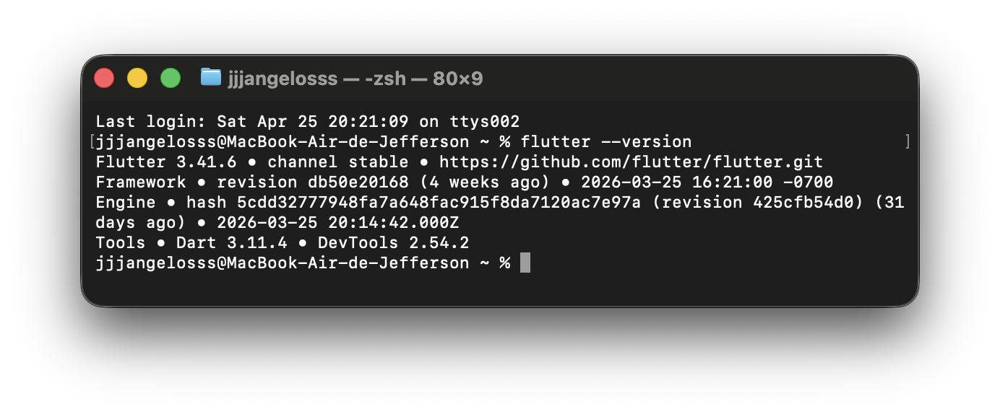

La captura evidencia que Flutter esta instalado en el canal `stable`, version `3.41.6`. Tambien confirma Dart `3.11.4` y DevTools `2.54.2`. Dart no requiere instalacion separada, ya que viene incluido con Flutter.

### 3.3 Configuracion para iOS con Xcode

Para desarrollar y ejecutar aplicaciones Flutter en iOS, macOS requiere Xcode. Esta herramienta permite compilar el proyecto para dispositivos iOS o simuladores, y tambien provee herramientas de linea de comandos necesarias para Flutter.

Comandos de verificacion utilizados:

```bash
xcodebuild -version
xcode-select -p
```

**Version de Xcode**

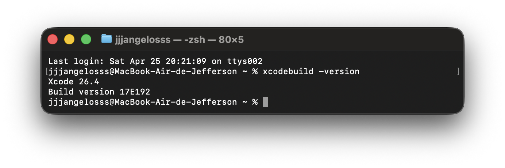

La captura confirma la instalacion de Xcode `26.4`, build `17E192`.

**Xcode instalado**

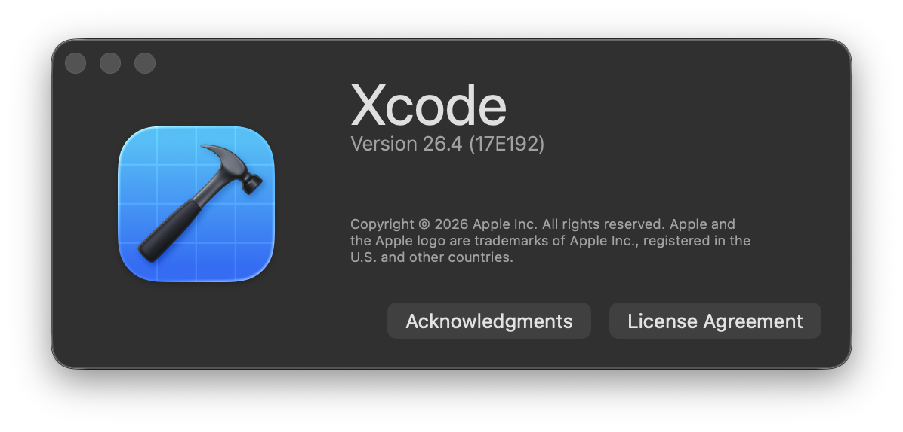

La captura muestra la ventana "About Xcode", donde se valida visualmente la version instalada.

**Herramientas de linea de comandos de Xcode**

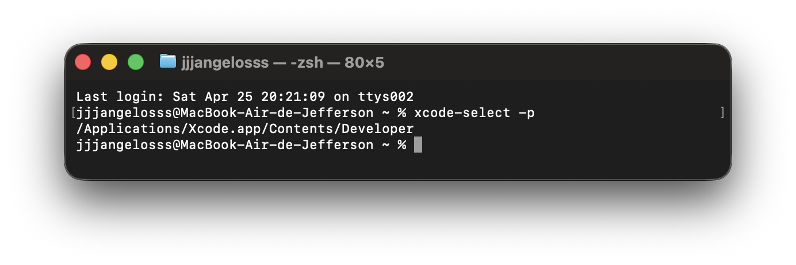

El comando `xcode-select -p` devuelve `/Applications/Xcode.app/Contents/Developer`, lo que confirma que macOS utiliza Xcode como ruta activa de desarrollo para compilar proyectos iOS.

### 3.4 Configuracion para Android con Android Studio

Para ejecutar ReportaYA en Android se utilizo Android Studio, ya que permite instalar y administrar el Android SDK, las herramientas de compilacion y los emuladores.

Componentes necesarios:

- Android SDK.
- Android SDK Platform-Tools.
- Android SDK Build-Tools.
- Android Emulator.
- Android SDK Command-line Tools.

**Android SDK Manager**

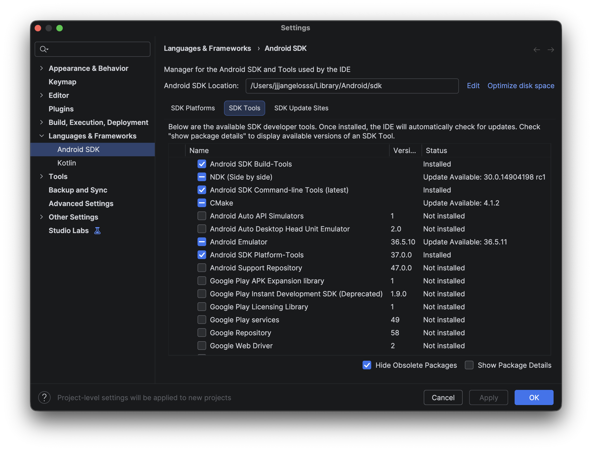

La captura evidencia la ruta local del SDK Android y las herramientas instaladas desde Android Studio, necesarias para compilar y ejecutar el proyecto en Android.

**Seleccion del dispositivo virtual**

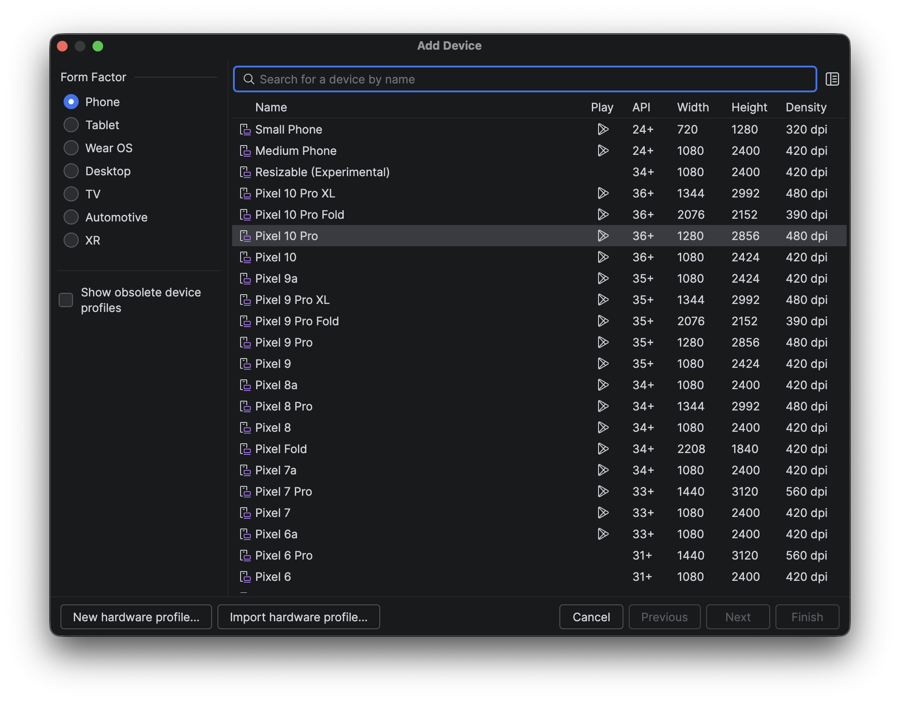

La captura muestra la ventana Add Device durante la creacion de un dispositivo virtual Android. Desde esta seccion se selecciona el perfil de telefono que se utilizara para simular y probar la aplicacion.

**Emulador creado en Device Manager**

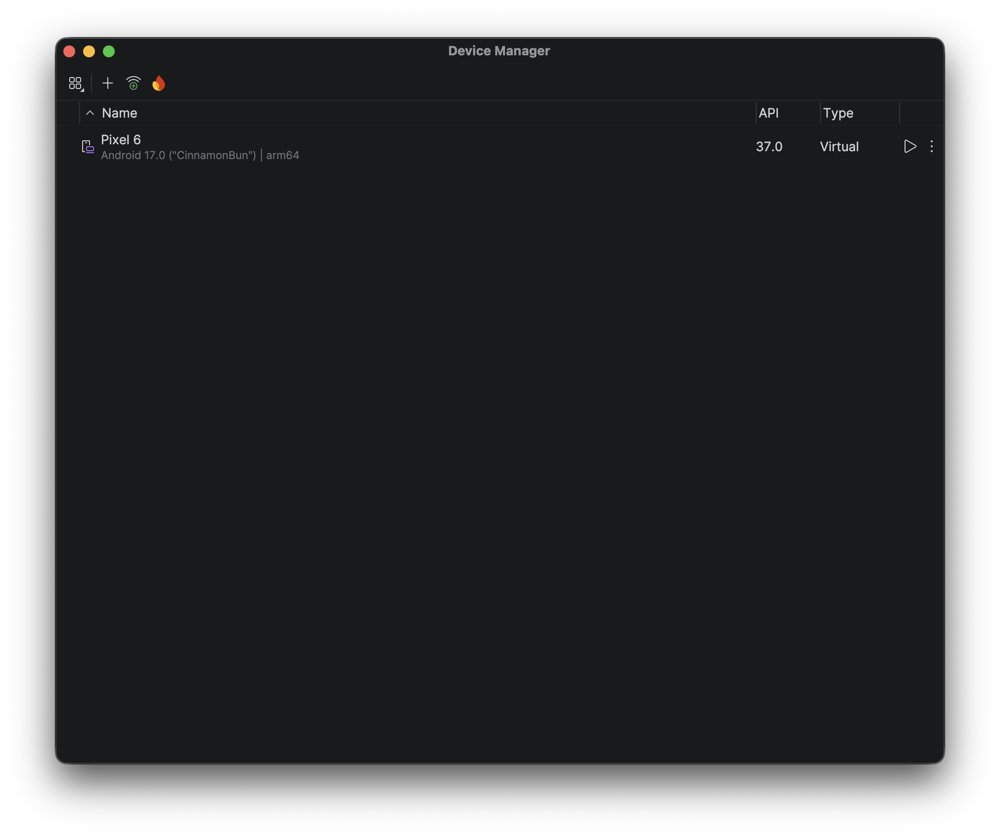

La captura muestra el Device Manager luego de crear el emulador. Se observa el dispositivo virtual Pixel 6 disponible para ejecutar y probar el aplicativo.

### 3.5 Herramientas complementarias

Ademas de Flutter, Xcode y Android Studio, se verificaron herramientas necesarias para compilar correctamente en Android e iOS.

Comandos utilizados:

```bash
java -version
pod --version
```

**Version de Java**

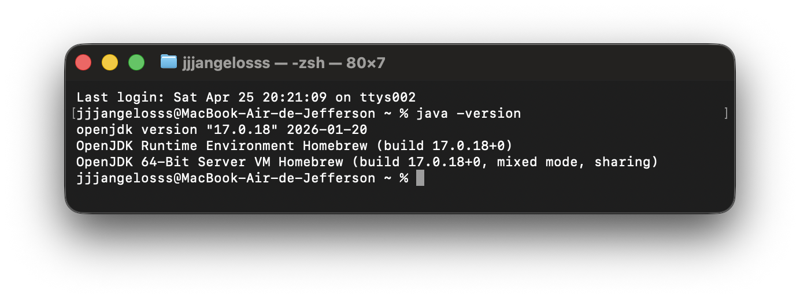

La captura confirma el uso de OpenJDK `17.0.18`, instalado mediante Homebrew. Java es requerido por las herramientas de Android para compilar y ejecutar la aplicacion en emuladores o dispositivos Android.

**Version de CocoaPods**

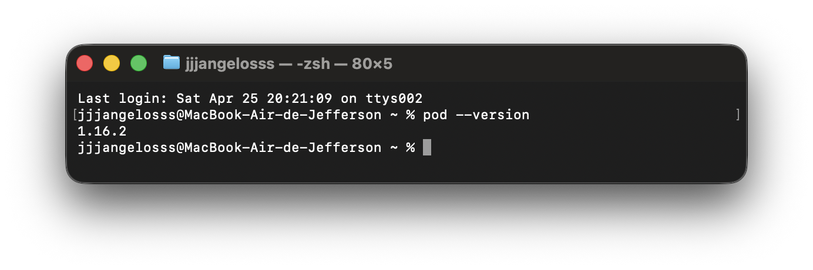

La captura confirma que CocoaPods esta instalado en la version `1.16.2`. CocoaPods se utiliza para gestionar dependencias nativas de iOS cuando el proyecto Flutter incorpora paquetes con integracion para el ecosistema Apple.

### 3.6 Verificacion general en macOS

Una vez configuradas las herramientas, se ejecuto el diagnostico general de Flutter:

```bash
flutter doctor -v
```

**Diagnostico del entorno con Flutter Doctor**

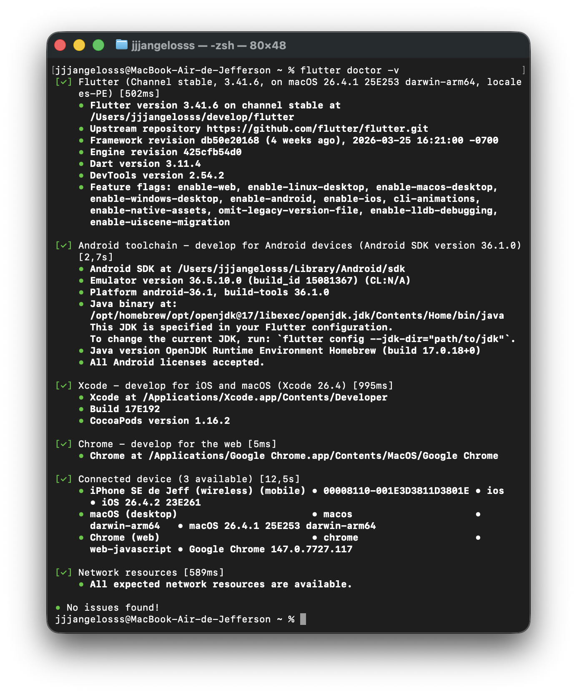

La captura de `flutter doctor -v` muestra que Flutter reconoce correctamente las herramientas instaladas previamente: Android toolchain, Xcode, Chrome, dispositivos conectados y recursos de red. El diagnostico final indica `No issues found`, por lo que el entorno queda validado para ejecutar el proyecto en las plataformas disponibles.

### 3.7 Configuracion del entorno en Windows

En Windows, la configuracion se orienta principalmente al desarrollo y ejecucion del proyecto en Android. La preparacion sigue el mismo criterio general: instalar Flutter SDK, configurar `PATH`, instalar Android Studio, configurar Android SDK y validar con `flutter doctor`.

Pasos considerados:

1. Descargar y extraer Flutter SDK en una ruta local, por ejemplo:

```text
%USERPROFILE%\develop\flutter
```

2. Agregar el directorio `bin` de Flutter a la variable de entorno `Path`:

```text
%USERPROFILE%\develop\flutter\bin
```

3. Cerrar y abrir nuevamente la terminal para aplicar los cambios.

4. Validar que Flutter y Dart puedan ejecutarse desde terminal:

```bash
flutter --version
dart --version
```

5. Instalar Android Studio y completar el asistente inicial de configuracion.

6. Desde Android Studio, instalar o verificar:

- Android SDK.
- Android SDK Platform-Tools.
- Android SDK Build-Tools.
- Android Emulator.
- Android SDK Command-line Tools.

7. Crear un emulador Android desde Device Manager o conectar un dispositivo fisico con depuracion USB habilitada.

8. Verificar la configuracion general:

```bash
flutter doctor -v
flutter devices
```

Nota: el documento **Configurar el desarrollo de Windows** tambien menciona Visual Studio con la carga de trabajo **Desarrollo de escritorio con C++**. Esta configuracion es necesaria si se desea compilar aplicaciones Flutter para escritorio Windows. Para el alcance movil de ReportaYA, Android Studio y Android SDK son los componentes principales en Windows.

### 3.8 Ejecucion y validacion del proyecto

El proyecto Flutter **ReportaYA-Front** fue creado inicialmente con el comando:

```bash
flutter create ReportaYA-Front
```

Este comando genera la estructura base de Flutter, incluyendo archivos como `pubspec.yaml`, `lib/main.dart`, `android/`, `ios/`, `test/` y configuraciones iniciales para ejecutar el proyecto.

En macOS se recomienda trabajar el proyecto desde una ruta neutral como `~/Projects`, en lugar de mantenerlo dentro de `Desktop`. Durante la preparacion del entorno se identifico que trabajar desde Desktop puede generar metadatos o atributos extendidos de macOS que afectan la compilacion para macOS, por ejemplo errores de firma relacionados con:

```text
resource fork, Finder information, or similar detritus not allowed
```

Por ello, la ruta recomendada para clonar o mover el proyecto es:

```text
~/Projects/ReportaYA-Front
```

Comandos recomendados para ubicar el proyecto en esa ruta:

```bash
mkdir -p ~/Projects
cd ~/Projects
git clone https://github.com/jeffangeloss/ReportaYA-Front.git
cd ~/Projects/ReportaYA-Front
```

Si el proyecto ya existe en otra ubicacion, se puede mover a `~/Projects` y limpiar atributos extendidos:

```bash
mkdir -p ~/Projects
mv ~/Desktop/ReportaYA-Front ~/Projects/ReportaYA-Front
cd ~/Projects/ReportaYA-Front
xattr -cr .
```

Luego de ubicarse en la raiz del proyecto, donde se encuentra `pubspec.yaml`, ejecutar:

```bash
flutter pub get
flutter run
```

Para revisar el estado del codigo:

```bash
flutter analyze
flutter test
```
## 4. Diagrama de despliegue

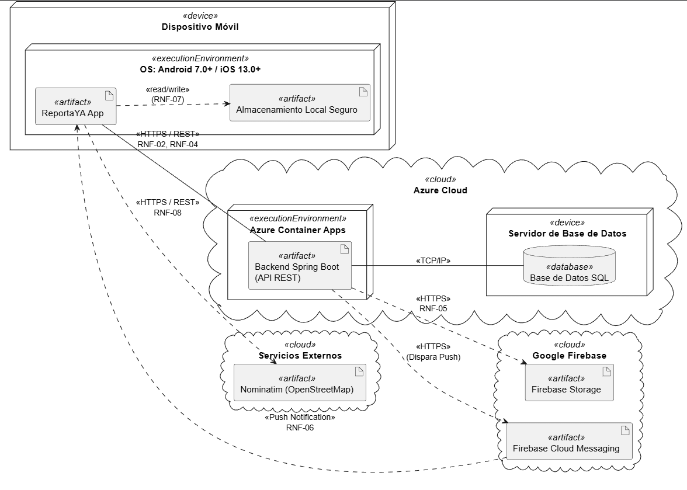

## 5. Requisitos no funcionales

Los requisitos no funcionales (RNF) describen las **cualidades** que debe cumplir el sistema **ReportaYA** mas alla de su funcionalidad: rendimiento, disponibilidad, seguridad, compatibilidad, etc. Cada RNF de esta seccion declara una **metrica medible** y se asocia explicitamente a un **nodo o enlace del diagrama de despliegue (seccion 4)**, garantizando trazabilidad entre lo que el sistema debe lograr y la infraestructura sobre la que se despliega.

### 5.1 Enfoque

- **Cada RNF tiene un identificador unico** (`RNF-NN`) para poder referenciarlo desde casos de uso, tareas y pruebas.
- **Cada RNF incluye un criterio de aceptacion concreto** (latencia objetivo, porcentaje de disponibilidad, etc.) — un RNF sin metrica no es verificable.
- **Cada RNF se ancla a un componente del diagrama de despliegue**, de modo que cuando se modifique la arquitectura sea evidente que requisitos pueden verse afectados.

### 5.2 Catalogo de RNF

| ID | Categoria | Descripcion | Criterio de aceptacion / metrica | Componente del diagrama de despliegue (seccion 4) |
|---|---|---|---|---|
| **RNF-01** | Compatibilidad | La aplicacion movil debe ejecutarse correctamente en Android y iOS. | Soporte para **Android 7.0 (API 24) y superiores** y **iOS 13.0 y superiores**. 100 % de los smoke tests aprobados en ambas plataformas en cada release. | Nodos `Mobile Device (Android)` y `Mobile Device (iOS)` |
| **RNF-02** | Rendimiento | Las operaciones REST entre la app y el backend deben responder rapidamente bajo carga normal. | Tiempo de respuesta **< 2 s en el percentil 95** medido desde el cliente, en operaciones de lectura paginadas y creacion de reportes. | Enlace `Mobile App ↔ Backend (HTTPS REST)` |
| **RNF-03** | Disponibilidad | El backend debe estar disponible la mayor parte del tiempo para no bloquear la creacion ni la consulta de reportes. | **Uptime ≥ 99 % mensual** en el servicio de API. | Nodo `Backend Spring Boot` desplegado en `Azure Container Apps` |
| **RNF-04** | Seguridad — transporte | Toda comunicacion entre la app movil y el backend debe ir cifrada y autenticada. | Uso obligatorio de **TLS 1.2 o superior** y validacion de credenciales en cada login. Sin endpoints publicos sin autenticacion (a excepcion del propio `/api/auth/login`). | Enlace `Mobile App ↔ Backend (HTTPS REST)` |
| **RNF-05** | Almacenamiento de evidencias | Las fotos adjuntadas por los tecnicos para resolver un reporte deben almacenarse fuera del backend para evitar saturacion. | **Subida de foto < 5 s** para imagenes ≤ 5 MB. URL publica devuelta al cliente. Respaldo en almacenamiento local del backend si Firebase Storage no esta disponible. | Enlace `Backend → Firebase Storage` |
| **RNF-06** | Notificaciones en tiempo real | Los cambios de estado de un reporte deben llegar al usuario afectado sin que tenga que refrescar la app. | **Latencia de push < 5 s** entre el evento de cambio de estado y la entrega de la notificacion al dispositivo. | Enlace `Backend → Firebase Cloud Messaging → Mobile App` |
| **RNF-07** | Persistencia local de sesion | El usuario no debe re-autenticarse cada vez que abre la aplicacion. | Sesion valida durante **24 horas** desde el ultimo login, almacenada de forma segura (almacenamiento cifrado del dispositivo, no en texto plano). | Componente local `Almacenamiento seguro` dentro del nodo `Mobile Device` |
| **RNF-08** | Geolocalizacion y geocodificacion | El reporte debe registrar la ubicacion del incidente con precision suficiente para que un tecnico lo encuentre. | Precision GPS **< 50 m** en exteriores. Reverse geocoding (coordenadas → direccion textual) disponible para mostrar la calle al usuario. | Enlace `Mobile App → Nominatim (OpenStreetMap)` |

### 5.3 Trazabilidad RNF ↔ Diagrama de despliegue

El siguiente grafo resume como cada RNF se conecta con un componente o enlace del diagrama de despliegue. Sirve como ancla visual independiente de la seccion 4 y demuestra que los RNF se diseñaron pensando en la arquitectura objetivo.

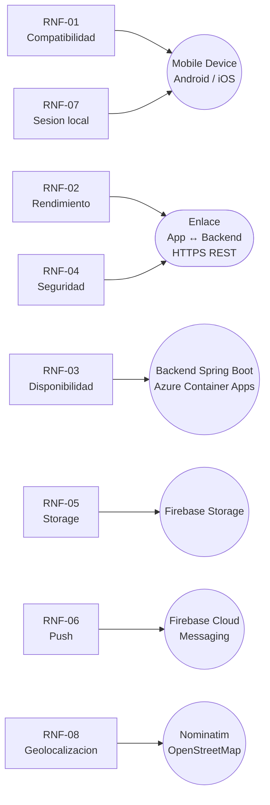

> Nota: el diagrama completo de despliegue se encuentra en la **seccion 4**. Los RNF de esta seccion ya estan alineados con los nodos y enlaces que ese diagrama incluye.

### 5.4 Verificacion de los RNF

Cada RNF se validara con una de las siguientes tecnicas durante las iteraciones del proyecto:

| Tecnica | Aplicada a |
|---|---|
| Smoke tests automaticos en CI (Android + iOS) | RNF-01 |
| Pruebas de carga con `k6` o `Apache JMeter` contra el backend | RNF-02, RNF-03 |
| Inspeccion de cabeceras TLS y revision manual de endpoints | RNF-04 |
| Medicion manual de tiempos de subida y entrega | RNF-05, RNF-06 |
| Test de integracion sobre `flutter_secure_storage` y verificacion de TTL | RNF-07 |
| Pruebas de campo con dispositivos reales en distintos puntos de Lima | RNF-08 |

## 6. Requerimientos funcionales

Los requerimientos funcionales de **ReportaYA** describen las acciones y capacidades que el sistema debe proporcionar a sus usuarios. Cada RF esta vinculado a un caso de uso especifico y se complementa con el diagrama y la descripcion de casos de uso.

### 6.1 Catalogo de requisitos funcionales

| ID | Requisito Funcional | Caso de Uso Relacionado | Actor(es) |
|---|---|---|---|
| **RF-01** | El sistema debe permitir a los usuarios (Ciudadano, Operador de Oficina Municipal, Técnico de Campo Municipal) autenticarse ingresando sus credenciales para acceder a la vista correspondiente a su rol. | CU01 - Iniciar sesión | Todos |
| **RF-02** | El sistema debe permitir a los ciudadanos crear una cuenta proporcionando sus datos personales y debe enviar un correo de confirmación para activar el perfil. | CU02 - Registrarse | Todos |
| **RF-03** | El sistema debe permitir a los usuarios solicitar la recuperación de su contraseña mediante el envío de un enlace o token al correo electrónico registrado. | CU03 - Recuperar contraseña | Todos |
| **RF-04** | El sistema debe permitir a los ciudadanos crear, enviar y hacer seguimiento a nuevos reportes de incidentes urbanos, incluyendo la ubicación, tipo de problema, descripción detallada y evidencia multimedia. | CU04 - Reportar incidencia urbana | Ciudadano |
| **RF-05** | El sistema debe permitir a los usuarios visualizar, filtrar y explorar los reportes mediante un listado detallado y un mapa interactivo (con leyenda de colores e íconos), además de enviar notificaciones de estado. | CU05 - Consultar reportes | Ciudadano, Operador, Técnico |
| **RF-06** | El sistema debe permitir al Operador de Oficina Municipal revisar, aprobar o rechazar los reportes ingresados, asignarles un nivel de prioridad y notificar al ciudadano la decisión tomada. | CU06 - Validar reportes ciudadanos | Operador de Oficina |
| **RF-07** | El sistema debe permitir al Operador de Oficina Municipal asignar un técnico de campo a un reporte previamente aprobado, y facilitar el seguimiento del mismo hasta su resolución. | CU07 - Asignar reportes | Operador de Oficina |
| **RF-08** | El sistema debe permitir al Técnico de Campo Municipal revisar sus tareas asignadas, actualizar el estado del reporte, adjuntar evidencia fotográfica, añadir comentarios sobre la solución y confirmar la finalización en campo. | CU08 - Atender reporte | Técnico de Campo |

### 6.2 Actores del sistema

| Actor | Descripcion |
|---|---|
| **Ciudadano** | Usuario que reporta incidentes urbanos y hace seguimiento a sus reportes. Puede crear cuenta, autenticarse, crear reportes y visualizar su estado. |
| **Operador de Oficina Municipal** | Usuario responsable de validar y priorizar reportes. Revisa reportes de ciudadanos, aprueba o rechaza, asigna técnicos, y notifica decisiones. |
| **Técnico de Campo Municipal** | Usuario responsable de resolver reportes en el terreno. Recibe asignaciones, actualiza estados, adjunta evidencias fotográficas y cierra reportes. |

### 6.3 Diagrama de casos de uso
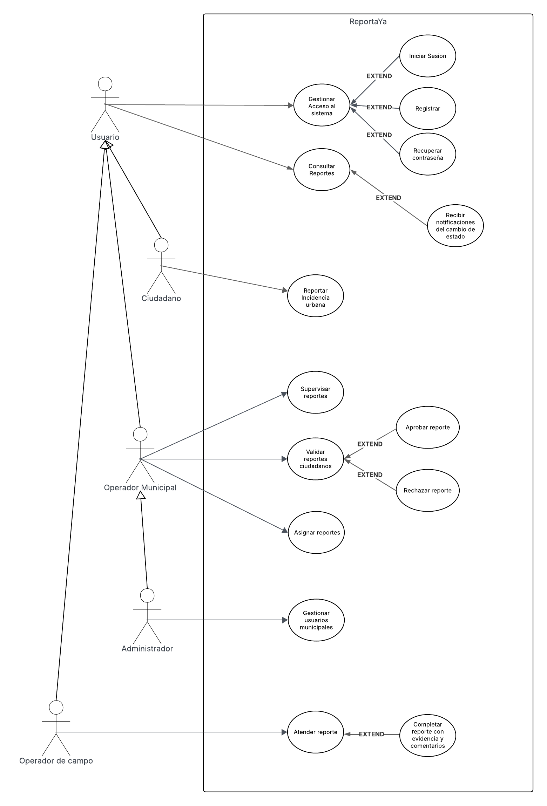

### 6.4 Descripcion de casos de uso

| ID     | Caso de Uso           | Actor                           | Descripción                                                                 | Precondición                                      |
|--------|-----------------------|--------------------------------|-----------------------------------------------------------------------------|---------------------------------------------------|
| CU01 | Iniciar sesión | Usuario (Ciudadano, Operador de Oficina Municipal, Técnico de Campo Municipal) | Permitir que un usuario autenticado acceda a la aplicación ingresando sus credenciales y sea dirigido a la vista correspondiente a su rol. | La aplicación está disponible y el usuario dispone de conexión a Internet. |
| CU02 | Registrarse | Usuario (Ciudadano, Operador de Oficina Municipal, Técnico de Campo Municipal) | Permitir que un ciudadano cree una cuenta proporcionando sus datos y reciba un correo de confirmación para activar su perfil. | La aplicación está disponible y el usuario dispone de conexión a Internet. |
| CU03 | Recuperar contraseña | Usuario (Ciudadano, Operador de Oficina Municipal, Técnico de Campo Municipal) | Permitir que un usuario restablezca su contraseña recibiendo un enlace o token en el correo que tenga registrado | La aplicación está disponible y el usuario dispone de conexión a Internet. |
| CU04 | Reportar incidencia urbana | Usuario (Ciudadano) | Permitir que un ciudadano cree  y envíe un nuevo reporte de incidente urbano, aportando ubicación, tipo de problema, descripción y evidencia multimedia, y posteriormente poder hacerle seguimiento. | El ciudadano ha iniciado sesión y ha accedido a la opción “Reportar incidencia” (Símbolo “+” en el mapa) en la aplicación. |
| CU05 | Consultar reportes | Usuario (Ciudadano, Operador de Oficina Municipal, Técnico de Campo Municipal) | Permitir que un usuario visualice, filtre y explore reportes de incidentes en un listado detallado y sobre un mapa interactivo, con notificaciones de estado y una leyenda de colores e íconos para facilitar la interpretación. | El usuario ha iniciado sesión, el sistema ha cargado los datos de los reportes y el mapa base y la conexión a los servicios de datos está activa. |
| CU06 | Validar reportes ciudadanos | Usuario (Operador de Oficina Municipal) | Permitir que un operador revise, apruebe o rechace los reportes recibidos, que asigne un nivel de prioridad y que notifique al ciudadano sobre la decisión tomada. | El usuario ha iniciado sesión como su rol correspondiente, existen reportes en estado “Pendiente de validación” y la interfaz de validación carga correctamente los datos del reporte. |
| CU07 | Asignar reportes | Usuario (Operador de Oficina Municipal) | Permitir que un operador designe al personal responsable (técnico de campo) para atender un reporte aprobado y asegurar su seguimiento hasta la resolución. | El usuario ha iniciado sesión como su rol correspondiente, existen reportes en estado “Aprobado” listos para asignar y  La lista de técnicos de campo está cargada y disponible. |
| CU08 | Atender reporte | Usuario (Técnico de Campo Municipal) | Permitir que un técnico revise las tareas asignadas, actualice el estado del reporte, aporte evidencia fotográfica y comentarios de la solución, y confirme la finalización del trabajo en campo. | El usuario ha iniciado sesión como su rol correspondiente y existe al menos un reporte en estado “Asignado” en su lista de tareas |

## 7. Mockups
Los mockups del proyecto se encuentran en el archivo HTML interactivo [ReportaYA_Diseno.html](./docs/images/ReportaYA_Diseno.html). GitHub muestra los archivos HTML como codigo fuente, por lo que para visualizarlos como prototipo se debe abrir el siguiente enlace: [ver mockups interactivos](https://htmlpreview.github.io/?https://github.com/jeffangeloss/ReportaYA-Front/blob/jeff/docs/images/ReportaYA_Diseno.html).

Para que puedan visualizarse directamente desde este documento, se incluyen capturas del sistema de diseno, las pantallas principales y el prototipo navegable.

### 7.1 Sistema de diseño

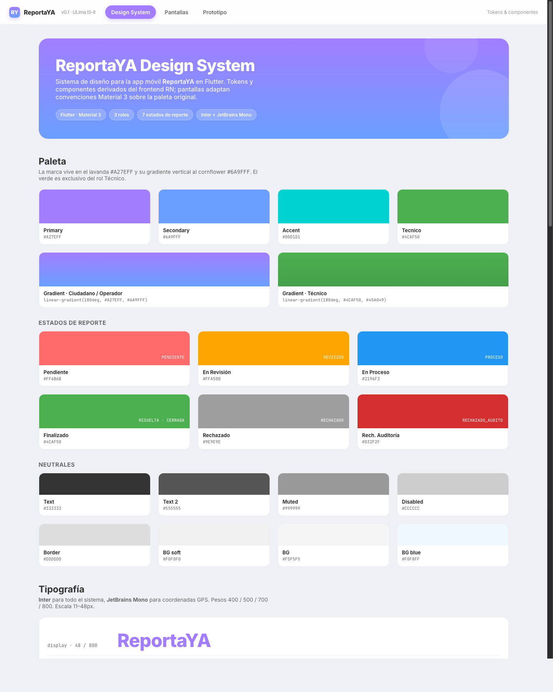

### 7.2 Pantallas principales

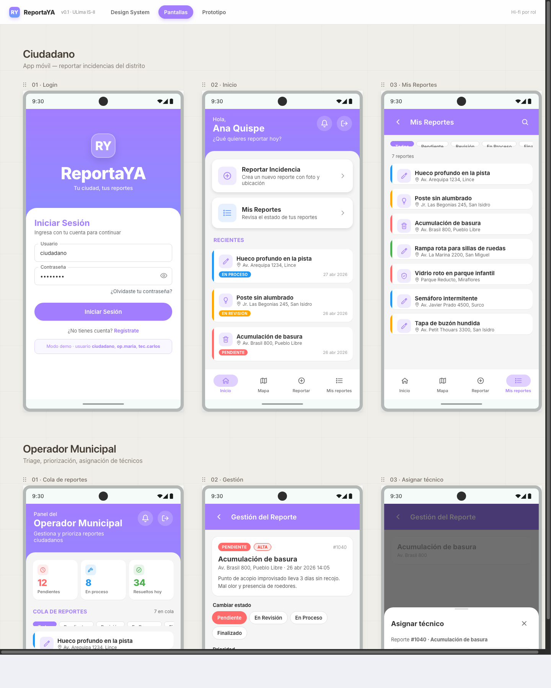

### 7.3 Prototipo navegable

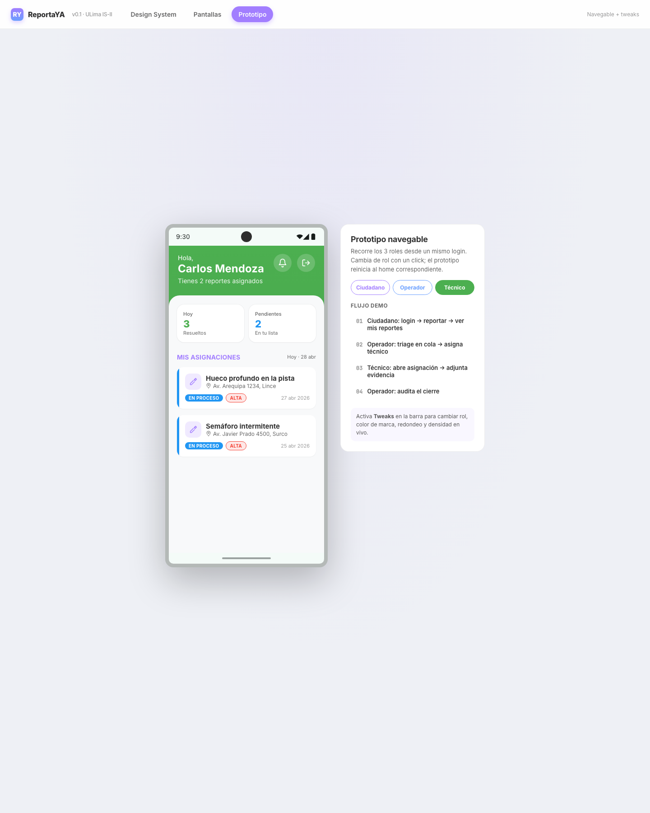

## 8. Diagrama de base de datos

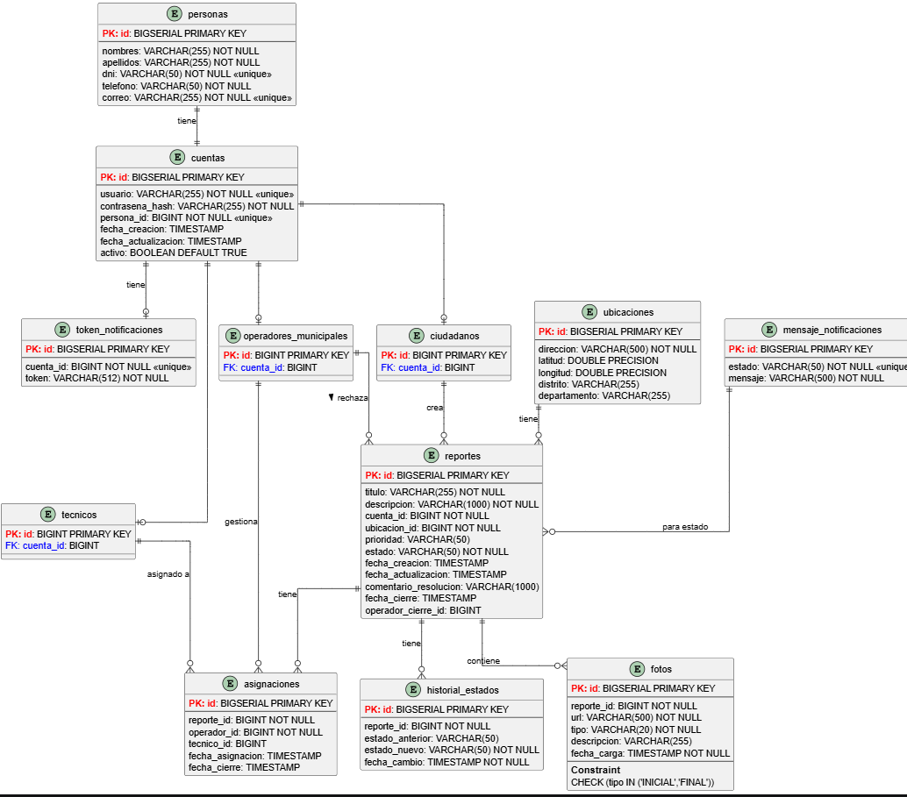

## 9. Tecnologias utilizadas

- Framework: Flutter.
- Lenguaje: Dart.
- Plataformas objetivo: Android e iOS.
- Gestion de dependencias: `pubspec.yaml`.

El archivo `pubspec.yaml` centraliza la configuracion principal del proyecto Flutter: nombre del proyecto, version, SDK de Dart, dependencias, dependencias de desarrollo y recursos declarados.

Dependencias configuradas actualmente:

```yaml
dependencies:
  flutter:
    sdk: flutter
  get: ^4.6.5
```

Luego de modificar este archivo, se debe ejecutar:

```bash
flutter pub get
```

Este comando descarga o actualiza las dependencias y regenera `pubspec.lock`, que registra las versiones resueltas para mantener consistencia entre los integrantes del equipo.

- Dependencias principales:
  - `flutter`: SDK principal para el desarrollo de la aplicacion.
  - `get: ^4.6.5`: paquete agregado para facilitar gestion de estado, rutas o inyeccion de dependencias en futuras iteraciones del proyecto.
- Dependencias de desarrollo:
  - `flutter_test`: pruebas automatizadas de widgets.
  - `flutter_lints: ^6.0.0`: reglas recomendadas de analisis estatico para mantener buenas practicas en Dart/Flutter.

## 10. Instalacion y ejecucion del proyecto

Ejecutar los siguientes comandos desde la raiz del proyecto:

```bash
flutter pub get
flutter run
```

Para verificar el estado del codigo:

```bash
flutter analyze
flutter test
```
